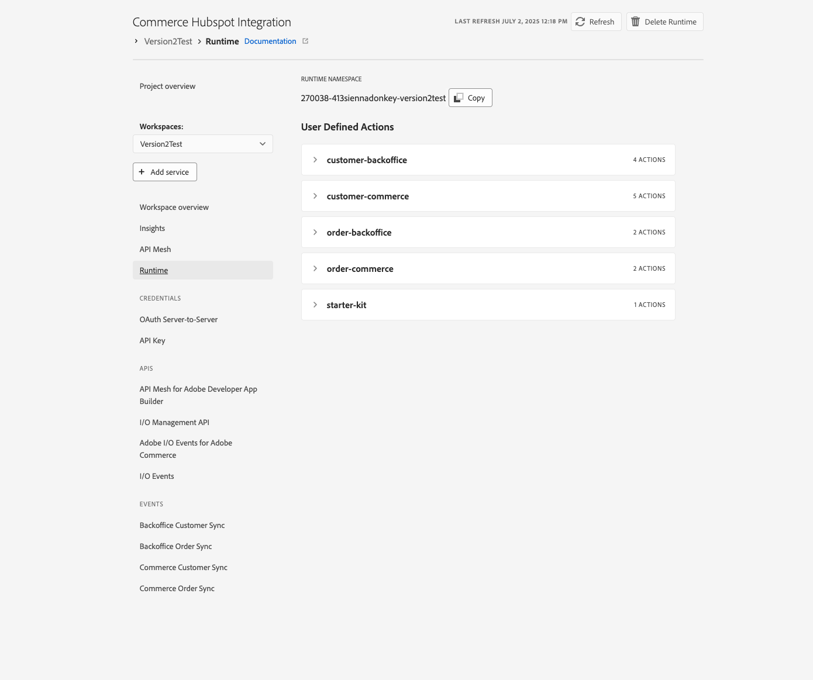
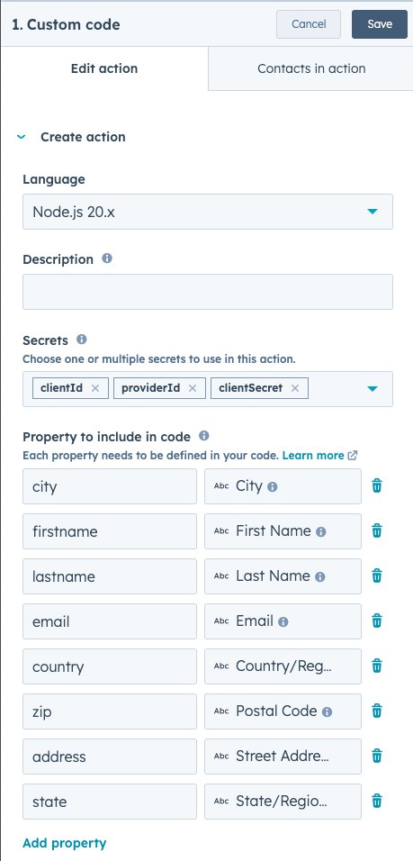
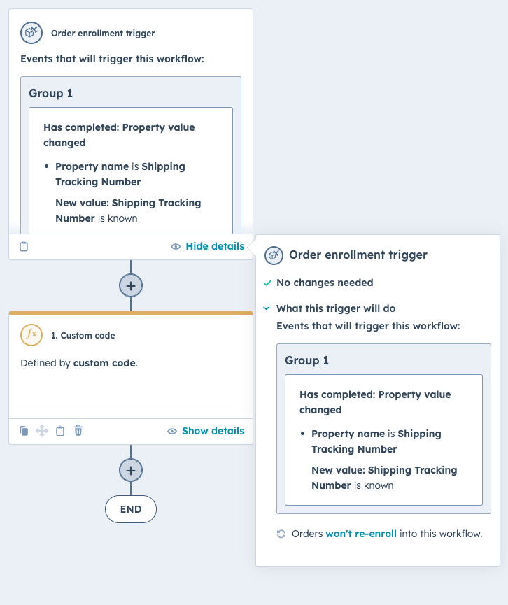
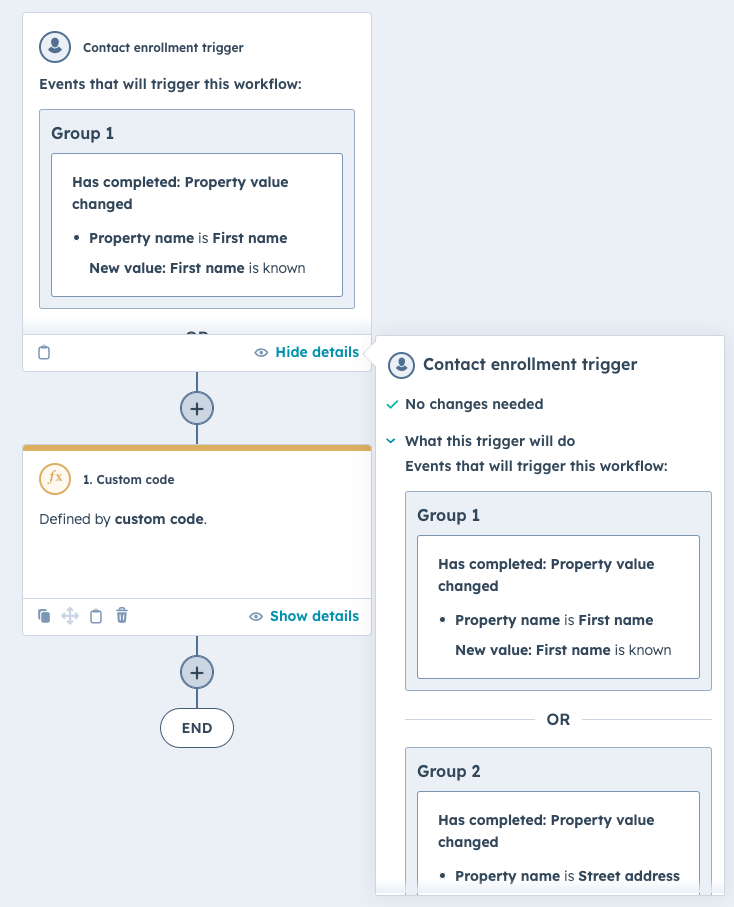

# Installation instructions for configuring Adobe Commerce and Hubspot integration

## Application

### Create App Builder project
Go to the [Adobe developer console](https://developer.adobe.com/console) portal
- Click on `Create a new project from template`
- Select `App Builder`
- Choose a name and title
- Select stage workspace or create a new one
- Add the following API services (select default Oauth server to server)
  - I/0 events
  - Adobe I/O Events for Adobe Commerce
  - I/O management API
- Download the [workspace configuration JSON](https://developer.adobe.com/commerce/extensibility/events/project-setup/#download-the-workspace-configuration-file) file and save it as `workspace.json` in the `./scripts/onboarding/config` folder because you will use it to configure Adobe IO Events in commerce afterward.

### Configure a new Integration in commerce 
Configure a new Integration to secure the calls to Commerce from App Builder using OAuth by following these steps:
- In the Commerce Admin, navigate to System > Extensions > Integrations.
- Click the `Add New Integration` button. The following screen displays
  
- Give the integration a name. The rest of the fields can be left blank.
- Select API on the left and grant access to all the resources.
  
- Click Save.
- In the list of integrations, activate your integration.
- To configure the module, you will need the integration details (consumer key, consumer secret, access token, and access token secret).

### Install Commerce Eventing module (only required when running Adobe Commerce versions 2.4.4 or 2.4.5) 
Install Adobe I/O Events for Adobe Commerce module in your commerce instance following this [documentation](https://developer.adobe.com/commerce/extensibility/events/installation/)

> **Note**
> 
> By upgrading the Adobe I/O Events for Adobe Commerce module to version 1.6.0 or greater, you will benefit from some additional automated steps during onboarding.  


## Commerce to Hubspot integration first deploy & onboarding
Following the next steps, you will deploy and onboard the integration for the first time. The onboarding process sets up event providers and registrations based on your selection.

### Download the project
- Download and unzip the project
- Copy the env file `cp env.dist .env`
- Fill in the values following the comments on the env file.

### Configure the project
Install the npm dependencies using the command:
```bash
npm install
```

This step will connect your project to the App builder project you created earlier.
Ensure to select the proper Organization > Project > Workspace with the following commands:
```bash
aio login
aio console org select
aio console project select
aio console workspace select
```

Sync your local application with the App Builder project using the following command:
```bash
aio app use --merge
# Choose the option 'm' (merge) to merge configurations
```

### Deploy
Run the following command to deploy the project; this will deploy the runtime actions needed for the onboarding step:
```bash
aio app deploy
```
You can confirm the success of the deployment in the Adobe Developer Console by navigating to the `Runtime` section on your workspace:


#### Execute the onboarding
This step will generate the IO Events providers and the registrations for your project.
If your Commerce instance Adobe I/O Events for Adobe Commerce module version 1.6.0 or greater, the module will also be automatically configured by the onboarding script.  
To start the process run the command:
```bash
npm run onboard
```

The console will return the provider's IDs and save this information:
- You will need the commerce instance ID and provider ID to configure your commerce instance later.
- You will need the backoffice provider id to send the events to the App builder project.

Check your App developer console to confirm the creation of the registrations.

### Complete the Adobe Commerce eventing configuration 

> **Note**
>
> If your Commerce instance Adobe I/O Events for Adobe Commerce module version is 1.6.0 or greater and the onboarding script completed successfully, the following steps are not required. The onboarding script will configure the Adobe Commerce instance automatically.
> Follow the steps in the next section to validate that the configuration is correct or skip to the next section.

You will configure your Adobe Commerce instance to send events to your App builder project using the following steps

#### Configure Adobe I/O Events in Adobe Commerce instance
To configure the provider in Commerce, do the following:
- In the Adobe Commerce Admin, navigate to Stores > Settings > Configuration > Adobe Services > Adobe I/O Events > General configuration. The following screen displays.
  
- Select `OAuth (Recommended)` from the `Adobe I/O Authorization Type` menu.
- Copy the contents of the `<workspace-name>.json` (Workspace configuration JSON you downloaded in the previous step [`Create app builder project`](#create-app-builder-project)) into the `Adobe I/O Workspace Configuration` field.
- Copy the commerce provider instance ID you saved in the previous step [`Execute the onboarding](#execute-the-onboarding) into the `Adobe Commerce Instance ID` field.
- Copy the commerce provider ID  you saved in the previous step [`Execute the onboarding`](#execute-the-onboarding) into the `Adobe I/O Event Provider ID` field.
- Click `Save Config`.
- Enable Commerce Eventing by setting the `Enabled` menu to Yes. (Note: You must enable cron so that Commerce can send events to the endpoint.)
- Enter the merchant's company name in the `Merchant ID` field. You must use alphanumeric and underscores only.
- In the `Environment ID` field, enter a temporary name for your workspaces while in development mode. When you are ready for production, change this value to a permanent value, such as `Production`.
- (Optional) By default, if an error occurs when Adobe Commerce attempts to send an event to Adobe I/O, Commerce retries a maximum of seven times. To change this value, uncheck the Use system value checkbox and set a new value in the Maximum retries to send events field.
- (Optional) By default, Adobe Commerce runs a cron job (clean_event_data) every 24 hours that delete event data three days old. To change the number of days to retain event data, uncheck the Use system value checkbox and set a new value in the Event retention time (in days) field.
- Click `Save Config`.

#### Subscribe to events in Adobe Commerce instance
> **Note**
>
> If your Commerce instance Adobe I/O Events for Adobe Commerce module version is 1.6.0 or greater, run the commerce-event-subscribe script to automatically subscribe to the Commerce events in `scripts/commerce-event-subscribe/config/commerce-event-subscribe.json`
> ```bash
> npm run commerce-event-subscribe
> ```
> Otherwise, follow the steps below to subscribe to the events manually.

To subscribe to events, follow this [documentation](https://developer.adobe.com/commerce/extensibility/events/configure-commerce/#subscribe-and-register-events).
For events of type 'plugin' you can also check this [documentation](https://developer.adobe.com/commerce/extensibility/events/commands/#subscribe-to-an-event).

Here are the events with the minimal required fields you need to subscribe to, it includes the REST API endpoints that could trigger this events:

| Entity         | Event                                                  | Required fields             | REST API Ref                                                                                                                                                                                                                                                                                                                                                                                                                                |
|----------------|--------------------------------------------------------|-----------------------------|---------------------------------------------------------------------------------------------------------------------------------------------------------------------------------------------------------------------------------------------------------------------------------------------------------------------------------------------------------------------------------------------------------------------------------------------|
| Customer       | observer.customer_save_commit_after                    | id, firstname, lastname, email, created_at, updated_at      | customer  [create](https://adobe-commerce.redoc.ly/2.4.6-admin/tag/customers#operation/PostV1Customers) / [update](https://adobe-commerce.redoc.ly/2.4.6-admin/tag/customerscustomerId#operation/PutV1CustomersCustomerId)                                                                                                                                                                                                                  |
| Company       | observer.observer.company_save_commit_after             | id, status, company_name, legal_name, company_email         | company [create](https://adobe-commerce.redoc.ly/2.4.6-admin/tag/company#operation/PostV1Company)                                                                                                                                                                                                                                                                                                                |
| Order          | observer.sales_order_save_commit_after                 | id, increment_id, created_at, updated_at     | order create [get](https://adobe-commerce.redoc.ly/2.4.6-admin/tag/orders#operation/GetV1Orders) |


## Hubspot

Hubspot is an integrated system and to connect Adobe Commerce with Hubspot you need to create integration and receive Bearer token for API connections.

### Configuration

Go to Data Management -> Data Integration and create a new App.

Inside of the created app you can switch to "Auth" tab and receive an Access Token.

Add to .env file of the project the following variable and add your value here: 

```
HUBSPOT_ACCESS_TOKEN=
```

Additionally you have to add to .env file:

```
COMMERCE_HUBSPOT_CONTACT_ID_FIELD=
```

It's an Adobe Commerce customer custom attribute code, which will be used to save Hubspot Customer ID, so in case if customer already being exported to Hubspot, system will perform Update and not Create action

For Full Data Synchronization, please also define: 

```
// Adobe Commerce Group ID for customers. (1 - General Group)
HUBSPOT_FULL_IMPORT_CONTACT_GROUP_ID=1
// Adobe Commerce Website Code to import 
HUBSPOT_FULL_IMPORT_CONTACT_WEBSITE=
```


### Hubspot -> Adobe Commerce sync

Part of the HubSpot integration involves enabling the synchronization of changes made in HubSpot back to Adobe Commerce.

Currently supported:

* Customer information being changed / new customer being created
* Shipment information was added on an Order level.

To achieve it you need to have access to "Automation" configuration on Hubspot side.

This integration coming with pre-built Hubspot onboarding script.

Please run: 

```
npm run onboard-hubspot
```

This will create 2 automation scripts on Hubspot side.

After creating 2 workflows, you need to go into each of them and add 3 secrets, so Workflows can authorize against App Builder application: 

* clientId - App Builder Client ID
* clientSecret - App Builder Client Secret
* providerId - App Builder provider ID for incoming events

So your custom code configuration will look at the end like following: 



#### Create new attributes (for B2B only)

In case you plan to use Companies synchronization, please create new attribute for Hubspot Contact: 

`external_company_id` - Text field. It will be used by script to save Adobe Commerce Customer ID there.

#### Manual Configuration (optional)

If automated way is not an option for you, you can create them manually.

On Hubport go to Automations -> Workflows -> Create a Workflow from scratch

##### Shipment sync

For shipment sync choose "Order" as main automation object.

Create the following automation: 



You can find the custom script in:

```
scripts/lib/hubspot/workflow_shipment.js
```

##### Customer sync

For shipment sync choose "Customer" as main automation object.

Create the following automation: 



Create group for each of attribute changed: 

* firstname
* lastname
* email
* city
* country
* zip
* address
* state

Custom script you can find:

```
scripts/lib/hubspot/workflow_customer.js
```

## Run initial synchronization

After you are done with installation steps, you can run initial synchronization. Module provides an API endpoint to start the sync process: 

```
curl --request POST \
  --url https://YOUR-APP-URL/api/v1/web/customer-backoffice/full-import \
  --header 'Authorization: Bearer TOKEN' \
  --header 'Content-Type: application/json' \
  --header 'x-gw-ims-org-id: ORGID' \
  --data '{
	"batchSize": "100"
}'
```